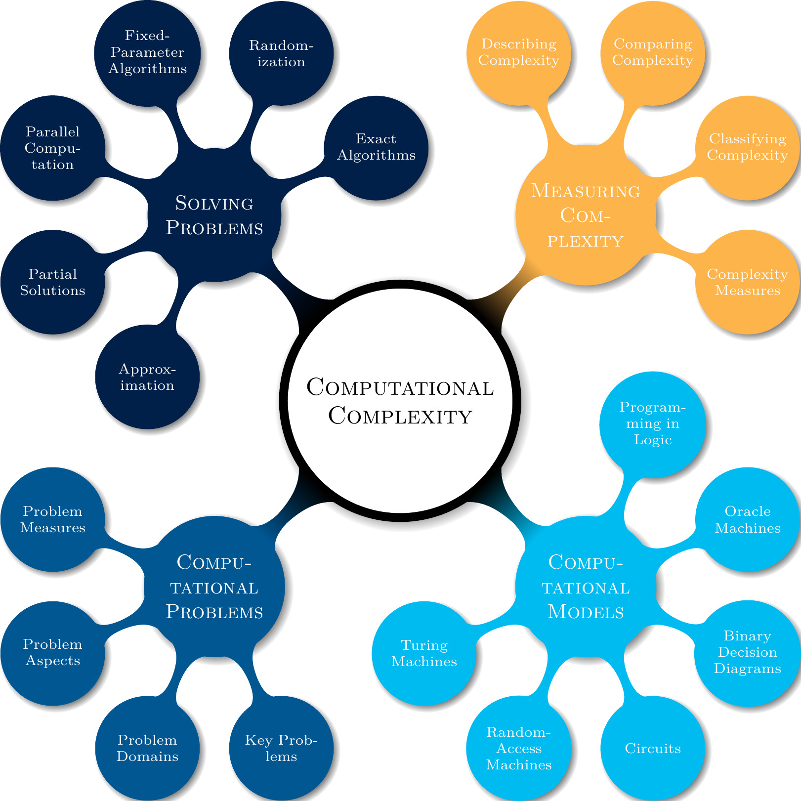

# tikz-colorscheme

`tikz-colorscheme` 是一个为使用 `tikz` 绘制出的图案提供配色方案的宏包，其内置了目前（2020-06-23） [colorhunt](https://colorhunt.co/) 网站上拥有的 2002 个配色方案。在使用时只需在 `tikzpicture` 环境外包装上本宏包内置的 `colorscheme` 环境即可自动使用多种配色方案生成图形。用户可以根据生成的图形进行挑选，选择最满意的配色方案并应用到最终的图形中。

`tikz-colorscheme` 宏包提供了 `colorscheme` 环境，使用方法详见 [example.tex](https://github.com/cs-qyzhang/tikz-colorscheme/blob/master/example.tex) 文件。

目前 `tikz-colorscheme` 宏包的基本实现采用的是 lua 语言，所以目前只支持 LuaTeX 引擎，后续可能会使用纯 TeX 实现。

`tikz-colorscheme` 目前只是一个原型，功能比较简单且单一，后续会对配色主题添加标签（如红色、灰色、渐变、强对比等）以适应不同的需求。若有任何想法欢迎提 issue 讨论。

